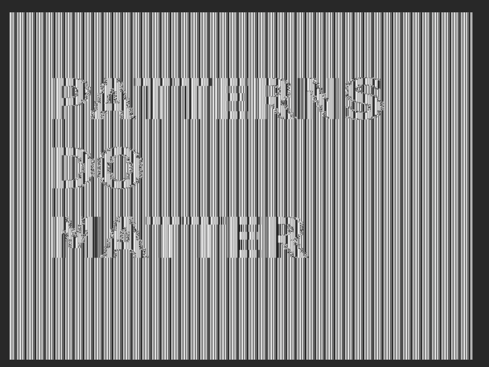

# Challenge 1
Ceasar cipher. We can simply shift the ciphertext by 1-26

```
cipher = "^s<qN}„{;t~bp?vN}„{;"
plaintext = ""

for i in range(26):
  plaintext = ""
  for char in cipher:
    plaintext += chr(ord(char) - i)
  print(plaintext, i)
```
This gives the following output
```
^s<qN}„{;t~bp?vN}„{; 0
]r;p~M|ƒz~:s}ao>uM|ƒz~: 1
\q:o}L{‚y}9r|`n=tL{‚y}9 2
[p9n|Kzx|8q{_m<sKzx|8 3
Zo8m{Jy€w{7pz^l;rJy€w{7 4
Yn7lzIxvz6oy]k:qIxvz6 5
Xm6kyHw~uy5nx\j9pHw~uy5 6
Wl5jxGv}tx4mw[i8oGv}tx4 7
Vk4iwFu|sw3lvZh7nFu|sw3 8
Uj3hvEt{rv2kuYg6mEt{rv2 9
Ti2guDszqu1jtXf5lDszqu1 10
Sh1ftCrypt0isWe4kCrypt0 11
Rg0esBqxos/hrVd3jBqxos/ 12
Qf/drApwnr.gqUc2iApwnr. 13
Pe.cq@ovmq-fpTb1h@ovmq- 14
Od-bp?nulp,eoSa0g?nulp, 15
Nc,ao>mtko+dnR`/f>mtko+ 16
Mb+`n=lsjn*cmQ_.e=lsjn* 17
La*_m<krim)blP^-d<krim) 18
K`)^l;jqhl(akO],c;jqhl( 19
J_(]k:ipgk'`jN\+b:ipgk' 20
I^'\j9hofj&_iM[*a9hofj& 21
H]&[i8gnei%^hLZ)`8gnei% 22
G\%Zh7fmdh$]gKY(_7fmdh$ 23
F[$Yg6elcg#\fJX'^6elcg# 24
EZ#Xf5dkbf"[eIW&]5dkbf" 25
```
We look through by hand and find readable text "Sh1ftCrypt0isWe4kCrypt0"


# Challenge 4
Using the context clue that the photo was taken with Olympus Deltis VC-1100, we look online to see what type of image format the camera supports. Looking on https://www.digitalkameramuseum.de/en/cameras/item/olympus-deltis-vc-1100, we see that the camera stores images as j6i files and also supports conversions to TIFF and BMP. The image resolution is also 768x576 

Using this, we assume that the image was encrypted using AES encryption which encrypts in blocks and thus shows patterns despite being encrypted. 

We first generate a BMP file. I did this by using photoshop to create a PNG file, and then using an online converter to a BMP file.

Take the BMP file and extract its header, copy the bytes after the header length from the encrypted image and then append the plaintext header to the encrypted data. 
- The head command needed some trial and error to get the correct number of lines to get the header but not too much of the sample image.

Viewing the new .bmp file, we can find the cipher text.

```
head -n 1 sample.bmp > header
stat -f%z header # gives 104
dd bs=1 skip=104 if=challenge4 of=content
cat header content > challenge4_image.bmp
```

The resulting image shows vertically flipped text of "PATTERNS DO MATTER"

