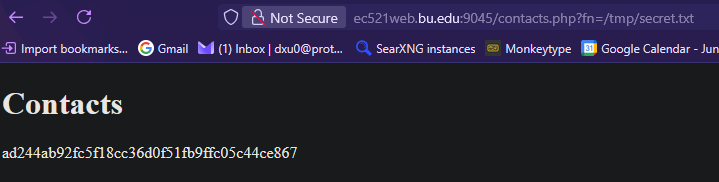
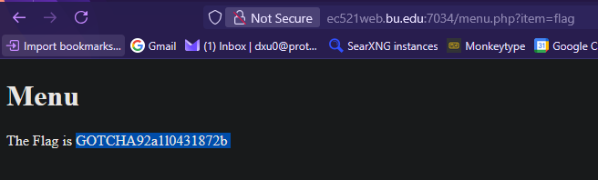
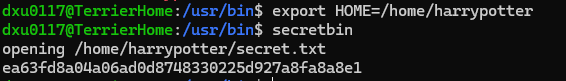
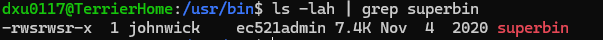
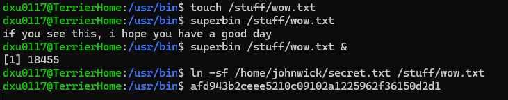

# Author
Derek Xu

# Challenge 1

File trajectory attack. The PHP file opens a directory specified by the "fn" query. We can change this query to `/tmp/secret.txt` to make the PHP file open the temp file secret.txt.



```
ad244ab92fc5f18cc36d0f51fb9ffc05c44ce867 
```

<br />

# Challenge 2
Similar to file trajectory attack, this takes advantage of the PHP file having access to a directory and being able to open and run any file within it. We can specify this file within the URL as the "item" query. Changing this value to "flag" exploits the PHP file to run the "flag" program instead.



```
The Flag is GOTCHA92a1l0431872b 
```

<br />

# Challenge 3
When searching for the binary, I saw that the program was created and owned by "harrypotter"


This gave me the impression that this program will act/open other files with harrypotter's permissions since the 's' bit was set. Thus, it could also be exploited to open harrypotter's files.

No matter the input I attempted to give it, it somehow always knew the path to open: `/home/{myusername}/secret.txt`. So I knew that it had to have gotten that path from somewhere. 

I tried changing my HOME shell variable as it originally had the value of `/home/{myusername}` to `/home/harrypotter`. Thus I got the following output when runnning secretbin again.




This is the answer to the CTF.

This meant the program was using the HOME variable to open your secret.txt, but since the executable had harrypotter's permissions, it was able to open and print harrypotter's secret instead.

<br />

# Challenge 4
This attack involves a TOCTOU attack. When running `superbin`, you can specify a file to open, but that file has to be under your permission. Though, there is a delay (supposedly) between the permission check, and the file read. Furthermore, the SUID of the program has the EUID under johnwick, so it can open johnwick's secret.txt even though we invoke it.



Using this info, we can create a file that anyone can read (in `/stuff`) and let the program open that, then create a symlink between that file and johnwick's secret.txt in the delay between the time of authorization and file open. This makes the program mistakenly open johnwick's secret.

*I edited the `/stuff/wow.txt` file in another terminal instance*




We get the following answer

```
afd943b2ceee5210c09102a1225962f36150d2d1
```

